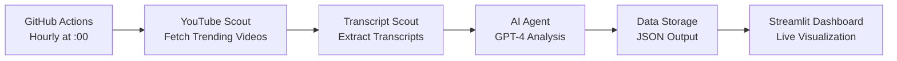

# 🤖 AI Trend & Content Factory Agent

[](https://github.com/features/actions)
[](https://streamlit.io/)
[](https://openai.com/)
[](https://developers.google.com/youtube/v3)
[](https://python.org/)

> A fully automated AI-powered content strategist that analyzes YouTube trends hourly and generates actionable insights using GPT-4.

## 📋 Table of Contents

- [Overview](#-overview)
- [Features](#-features)
- [Architecture](#-architecture)
- [Quick Start](#-quick-start)
- [Configuration](#-configuration)
- [Deployment](#-deployment)
- [API Setup](#-api-setup)
- [Usage](#-usage)
- [Project Structure](#-project-structure)
- [Troubleshooting](#-troubleshooting)
- [Contributing](#-contributing)
- [License](#-license)

## 🎯 Overview

The **AI Trend & Content Factory Agent** is a production-ready system that automatically:

1. **🔍 Scouts** trending YouTube videos using the YouTube Data API v3
2. **📝 Extracts** video transcripts with robust error handling
3. **🧠 Analyzes** content using OpenAI GPT-4 for trend insights
4. **📊 Generates** comprehensive daily reports
5. **🌐 Displays** results on a beautiful Streamlit dashboard

### Automation Workflow



## ✨ Features

### 🤖 **AI-Powered Analysis**
- **GPT-4 Integration**: Advanced trend analysis and predictions
- **Multi-dimensional Insights**: Content themes, engagement patterns, future trends
- **Individual Video Analysis**: Deep-dive insights for top performers

### 📊 **Comprehensive Data Collection**
- **YouTube Data API v3**: Trending videos, metrics, metadata
- **Transcript Extraction**: Multi-language support with fallback mechanisms
- **Engagement Analytics**: Views, likes, comments, duration analysis

### 🛡️ **Production-Ready Reliability**
- **Robust Error Handling**: Comprehensive exception management
- **Rate Limit Management**: Smart backoff and retry logic
- **Data Validation**: JSON schema validation and output verification
- **Health Monitoring**: Service status checks and diagnostics

### 🚀 **Automated Deployment**
- **GitHub Actions**: Fully automated hourly execution
- **Streamlit Cloud**: One-click dashboard deployment
- **Version Control**: Automatic result commits with detailed logs

### 📈 **Interactive Dashboard**
- **Real-time Metrics**: Live trending data visualization
- **Interactive Charts**: Plotly-powered engagement analytics
- **AI Insights Display**: Organized trend analysis presentation
- **Mobile-Responsive**: Works on all devices

## 🏗️ Architecture

```
┌─────────────────┐    ┌─────────────────┐    ┌─────────────────┐
│   GitHub Actions │    │   Data Sources  │    │   AI Processing │
│                 │    │                 │    │                 │
│ ┌─────────────┐ │    │ ┌─────────────┐ │    │ ┌─────────────┐ │
│ │ Hourly Cron │ │───▶│ │ YouTube API │ │───▶│ │   GPT-4     │ │
│ │   Every :00 │ │    │ │   v3 Data   │ │    │ │  Analysis   │ │
│ └─────────────┘ │    │ └─────────────┘ │    │ └─────────────┘ │
│                 │    │                 │    │                 │
│ ┌─────────────┐ │    │ ┌─────────────┐ │    │ ┌─────────────┐ │
│ │ Auto Commit │ │    │ │ Transcript  │ │    │ │   Trend     │ │
│ │   Results   │ │    │ │     API     │ │    │ │ Predictions │ │
│ └─────────────┘ │    │ └─────────────┘ │    │ └─────────────┘ │
└─────────────────┘    └─────────────────┘    └─────────────────┘
                                │                       │
                                ▼                       ▼
                    ┌─────────────────────────────────────────────┐
                    │           Data Storage & Display            │
                    │                                             │
                    │  ┌─────────────┐      ┌─────────────────┐  │
                    │  │    JSON     │────▶ │   Streamlit     │  │
                    │  │   Database  │      │   Dashboard     │  │
                    │  │             │      │                 │  │
                    │  └─────────────┘      └─────────────────┘  │
                    └─────────────────────────────────────────────┘
```

## 🚀 Quick Start

### Prerequisites

- **GitHub Account** with Actions enabled
- **YouTube Data API v3** key
- **OpenAI API** key
- **Streamlit Cloud** account (for dashboard deployment)

### 1. Repository Setup

```bash
# Clone the repository
git clone https://github.com/yourusername/trends-agent.git
cd trends-agent

# Install dependencies
pip install -r requirements.txt
```

### 2. Environment Configuration

Create a `.env` file (for local testing):

```env
YOUTUBE_API_KEY=your_youtube_api_key_here
OPENAI_API_KEY=your_openai_api_key_here
```

### 3. GitHub Secrets Setup

Add the following secrets to your GitHub repository:

1. Go to **Settings** → **Secrets and variables** → **Actions**
2. Add **New repository secret**:
   - `YOUTUBE_API_KEY`: Your YouTube Data API v3 key
   - `OPENAI_API_KEY`: Your OpenAI API key

### 4. Test Local Execution

```bash
# Set environment variables
export YOUTUBE_API_KEY="your_key"
export OPENAI_API_KEY="your_key"

# Run the agent
python main.py

# Start the dashboard
streamlit run app.py
```

## ⚙️ Configuration

### GitHub Actions Configuration

The workflow runs automatically every hour. You can customize it:

```yaml
# .github/workflows/daily_run.yml
on:
  schedule:
    - cron: '0 * * * *'  # Every hour at minute 0
  workflow_dispatch:       # Enable manual triggers
```

### Analysis Parameters

Modify these in the workflow or `main.py`:

```python
# Maximum videos to analyze
MAX_VIDEOS = 10

# Region for trending videos
REGION_CODE = 'US'  # US, GB, CA, etc.

# Language preferences for transcripts
LANGUAGE_CODES = ['en', 'en-US', 'en-GB']
```

### OpenAI Model Settings

In `src/brain/agent.py`:

```python
# Model configuration
self.model = "gpt-4o"           # or "gpt-4-turbo"
self.max_tokens = 4000          # Response length
self.temperature = 0.7          # Creativity level
```

## 🌐 Deployment

### Streamlit Cloud Deployment

1. **Connect Repository**:
   - Go to [Streamlit Cloud](https://share.streamlit.io/)
   - Click **"New app"**
   - Select your GitHub repository

2. **Configure App**:
   - **Main file path**: `app.py` (already at root level)
   - **Python version**: `3.11`
   - **Requirements**: `requirements.txt` (auto-detected)

3. **Deploy**:
   - Click **"Deploy!"**
   - Your dashboard will be available at: `https://yourapp.streamlit.app`

### Manual Server Deployment

```bash
# Install and run
pip install -r requirements.txt
streamlit run app.py --server.port 8501 --server.address 0.0.0.0
```

## 🔑 API Setup

### YouTube Data API v3

1. **Google Cloud Console**:
   - Go to [Google Cloud Console](https://console.cloud.google.com/)
   - Create a new project or select existing
   - Enable **YouTube Data API v3**

2. **Create API Key**:
   - Go to **Credentials** → **Create Credentials** → **API Key**
   - Restrict the key to **YouTube Data API v3**
   - Copy the key for GitHub secrets

3. **Quotas & Limits**:
   - **Daily quota**: 10,000 units (default)
   - **Video list**: ~1 unit per video
   - **Video details**: ~1 unit per video
   - **Monitor usage** in Google Cloud Console

### OpenAI API

1. **OpenAI Platform**:
   - Go to [OpenAI Platform](https://platform.openai.com/)
   - Create account and verify phone number
   - Navigate to **API Keys**

2. **Create API Key**:
   - Click **"Create new secret key"**
   - Copy the key (save it securely)
   - Add to GitHub secrets

3. **Billing & Limits**:
   - **GPT-4**: ~$0.03-0.06 per 1K tokens
   - **Hourly cost**: ~$2-5 (estimated for 10 videos)
   - **Daily total**: ~$48-120 (24 hourly runs)
   - Set up **usage limits** to control costs

## 📖 Usage

### Automatic Execution

The agent runs automatically every hour via GitHub Actions:

1. ✅ **Fetches** trending YouTube videos
2. ✅ **Extracts** transcripts with error handling
3. ✅ **Analyzes** content with GPT-4
4. ✅ **Commits** results to `data/daily_brief.json`
5. ✅ **Updates** the Streamlit dashboard

### Manual Execution

Trigger manually from GitHub:

1. Go to **Actions** tab in your repository
2. Select **"🤖 Hourly Trend Analysis"** workflow
3. Click **"Run workflow"**
4. Optionally specify custom parameters

### Dashboard Features

Visit your Streamlit dashboard to view:

- **📊 Overview Metrics**: Total views, engagement rates
- **📈 Trending Videos**: Top performing content with links
- **📝 Transcript Coverage**: Analysis of available transcripts
- **🧠 AI Insights**: GPT-4 generated trend analysis
- **🔮 Predictions**: Future trend forecasts

## 📁 Project Structure

```
trends-agent/
├── .github/workflows/
│   └── daily_run.yml          # 🤖 GitHub Actions automation
├── src/                       # 📦 Core source code
│   ├── scouts/               # 🔍 Data collection modules
│   │   ├── youtube_scout.py  # YouTube API integration
│   │   └── transcript_scout.py # Transcript extraction
│   └── brain/                # 🧠 AI processing
│       └── agent.py          # OpenAI GPT-4 analysis
├── data/                     # 💾 Generated data
│   └── daily_brief.json      # Analysis output
├── main.py                   # 🚀 Application entry point
├── app.py                    # 🌐 Streamlit dashboard
├── requirements.txt          # 📋 Python dependencies
└── README.md                 # 📖 This documentation
```

### Key Files Explained

| File | Purpose | Key Features |
|------|---------|--------------|
| `main.py` | Entry point | Orchestrates entire workflow |
| `youtube_scout.py` | YouTube data | API integration, rate limiting |
| `transcript_scout.py` | Transcript extraction | **Robust error handling**, multi-language |
| `agent.py` | AI analysis | GPT-4 integration, structured insights |
| `app.py` | Dashboard | Interactive visualizations, real-time data |
| `daily_run.yml` | Automation | **Secure permissions**, hourly execution |

## 🔧 Troubleshooting

### Common Issues

#### 🚫 **"YouTube API quota exceeded"**
```bash
# Solutions:
1. Check quota usage in Google Cloud Console
2. Reduce MAX_VIDEOS in workflow
3. Wait for quota reset (daily)
4. Request quota increase from Google
```

#### 🔑 **"Invalid API key"**
```bash
# Check:
1. API key is correctly set in GitHub secrets
2. YouTube Data API v3 is enabled
3. API key restrictions are not too strict
4. Key hasn't expired
```

#### 📝 **"No transcripts available"**
```bash
# Normal behavior:
- Not all videos have transcripts
- Auto-generated transcripts may not exist
- Private/restricted videos can't be accessed
- Check transcript_scout.py logs for details
```

#### 🤖 **"OpenAI API error"**
```bash
# Solutions:
1. Check API key validity
2. Verify billing setup
3. Check rate limits
4. Reduce max_tokens if needed
```

### Debug Mode

Enable detailed logging:

```python
# In main.py, change logging level:
logging.basicConfig(level=logging.DEBUG)
```

### Health Checks

Test individual components:

```bash
# Test YouTube Scout
python -c "
from src.scouts.youtube_scout import YouTubeScout
scout = YouTubeScout()
videos = scout.get_trending_videos(max_results=1)
print(f'✅ YouTube: {len(videos)} videos')
"

# Test Transcript Scout
python -c "
from src.scouts.transcript_scout import TranscriptScout
scout = TranscriptScout()
result = scout.health_check()
print(f'✅ Transcripts: {result}')
"

# Test OpenAI Agent
python -c "
from src.brain.agent import ContentAgent
agent = ContentAgent()
result = agent.health_check()
print(f'✅ OpenAI: {result}')
"
```

## 🤝 Contributing

### Development Setup

```bash
# Clone and setup
git clone https://github.com/yourusername/trends-agent.git
cd trends-agent

# Create virtual environment
python -m venv venv
source venv/bin/activate  # Windows: venv\Scripts\activate

# Install dependencies
pip install -r requirements.txt

# Install development dependencies (optional)
pip install pytest black flake8
```

### Code Quality

```bash
# Format code
black src/ main.py app.py

# Lint code
flake8 src/ main.py app.py

# Run tests (if implemented)
pytest tests/
```

### Pull Request Process

1. **Fork** the repository
2. **Create** a feature branch: `git checkout -b feature/amazing-feature`
3. **Commit** changes: `git commit -m 'Add amazing feature'`
4. **Push** to branch: `git push origin feature/amazing-feature`
5. **Open** a Pull Request

### Feature Ideas

- 🌍 **Multi-region support**: Analyze trends across different countries
- 📊 **Historical tracking**: Track trend changes over time
- 🔔 **Alerts system**: Notify when specific trends emerge
- 📱 **Mobile app**: React Native dashboard
- 🎥 **Video recommendations**: Content creation suggestions
- 📈 **Advanced analytics**: Machine learning trend prediction

## 📄 License

This project is licensed under the **MIT License** - see the [LICENSE](LICENSE) file for details.

```
MIT License

Copyright (c) 2025 AI Trend & Content Factory Agent

Permission is hereby granted, free of charge, to any person obtaining a copy
of this software and associated documentation files (the "Software"), to deal
in the Software without restriction, including without limitation the rights
to use, copy, modify, merge, publish, distribute, sublicense, and/or sell
copies of the Software, and to permit persons to whom the Software is
furnished to do so, subject to the following conditions:

The above copyright notice and this permission notice shall be included in all
copies or substantial portions of the Software.

THE SOFTWARE IS PROVIDED "AS IS", WITHOUT WARRANTY OF ANY KIND, EXPRESS OR
IMPLIED, INCLUDING BUT NOT LIMITED TO THE WARRANTIES OF MERCHANTABILITY,
FITNESS FOR A PARTICULAR PURPOSE AND NONINFRINGEMENT. IN NO EVENT SHALL THE
AUTHORS OR COPYRIGHT HOLDERS BE LIABLE FOR ANY CLAIM, DAMAGES OR OTHER
LIABILITY, WHETHER IN AN ACTION OF CONTRACT, TORT OR OTHERWISE, ARISING FROM,
OUT OF OR IN CONNECTION WITH THE SOFTWARE OR THE USE OR OTHER DEALINGS IN THE
SOFTWARE.
```

---

## 📞 Support

- **📧 Issues**: [GitHub Issues](https://github.com/yourusername/trends-agent/issues)
- **💬 Discussions**: [GitHub Discussions](https://github.com/yourusername/trends-agent/discussions)
- **📖 Documentation**: This README and inline code comments

---

<div align="center">

**🤖 Built with AI • 📊 Powered by Data • 🚀 Automated with GitHub Actions**

[](https://github.com/yourusername/trends-agent)
[](https://github.com/yourusername/trends-agent/fork)

*Made with ❤️ for content creators and trend analysts*

</div>